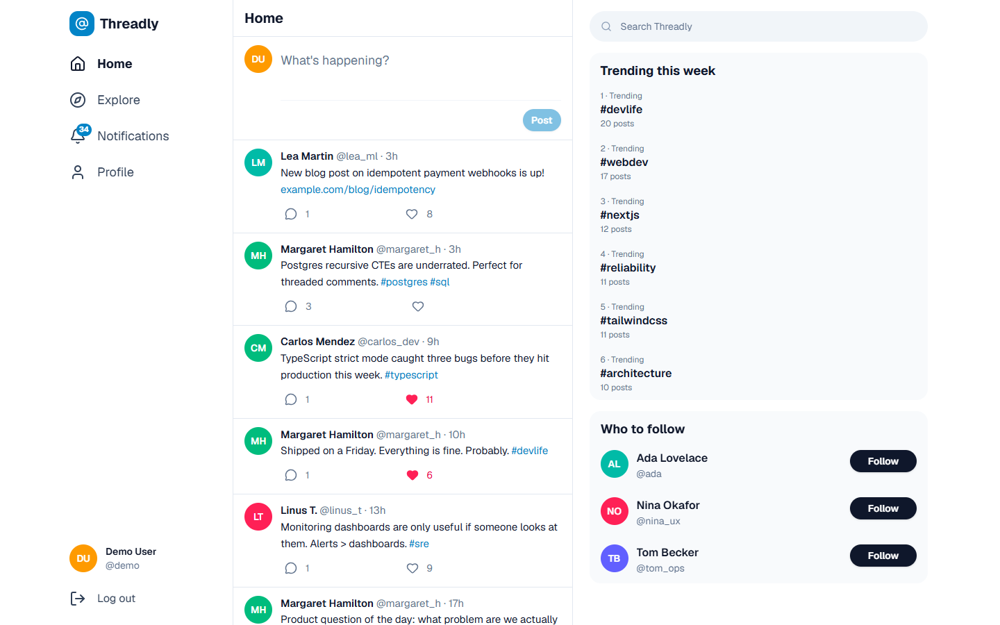
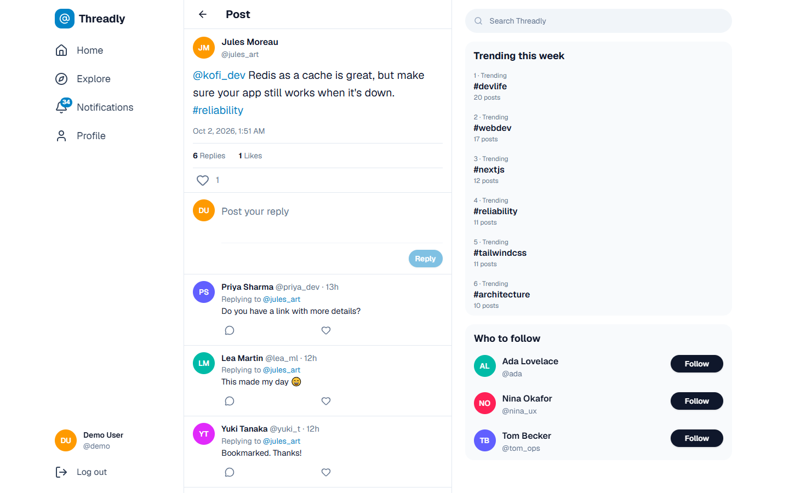
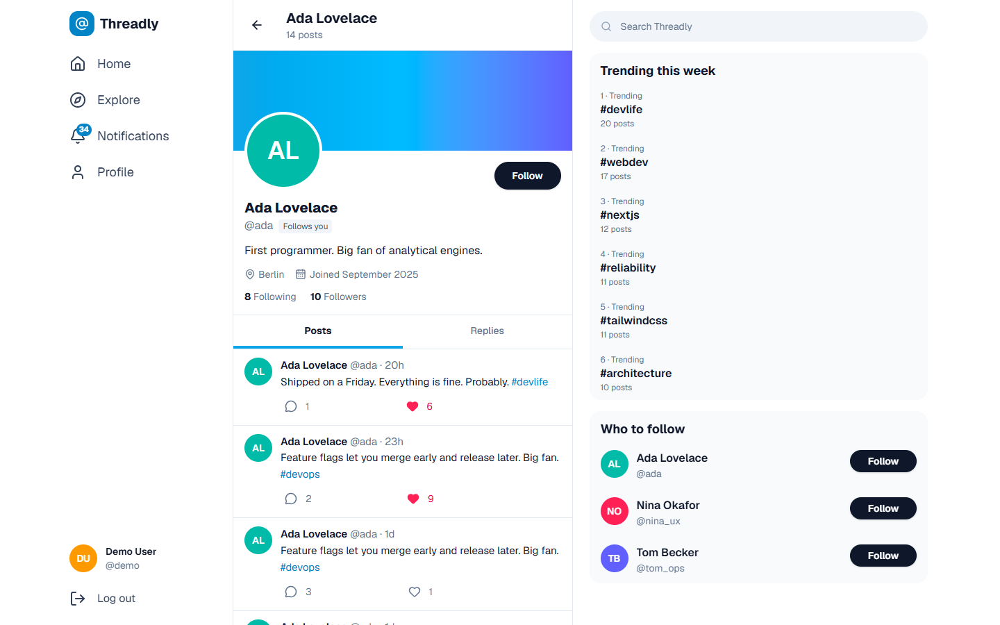
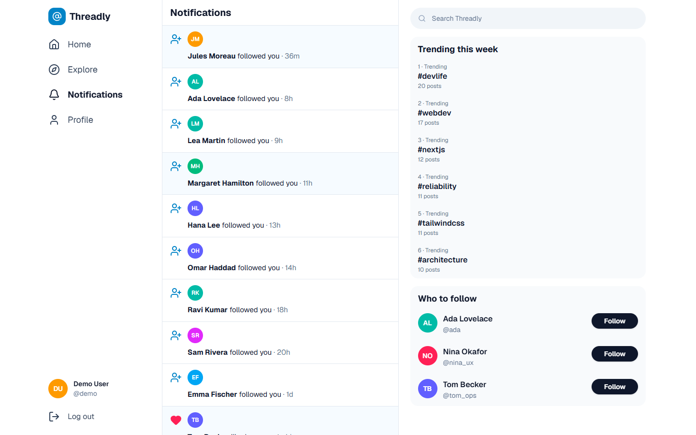
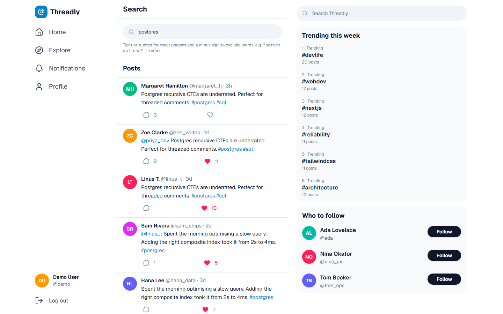
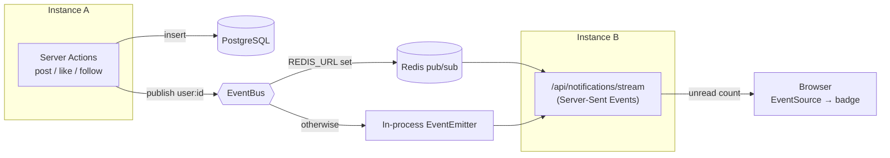

# Threadly — Real-time Social Network

[](https://github.com/ebrahimmorkas/threadly-social/actions/workflows/ci.yml)


Threadly is a Twitter/X-style social network: post short updates, reply in threads, like and follow, discover hashtags, search, and receive **real-time notifications** over Server-Sent Events.

It is built with the Next.js 16 App Router, React 19 and PostgreSQL. **Redis is optional** — without it the app uses in-memory caching and an in-process event bus; with it, caching, rate limits and real-time events are shared across any number of app instances.



## Features

- **Posts & threads** — 280-character posts with a live character ring, threaded replies, and full conversation view (ancestors loaded with a recursive CTE)
- **Feeds with infinite scroll** — Home (people you follow), Explore, profiles and hashtags, all using keyset (cursor) pagination
- **Optimistic likes and follows** — instant UI with React 19 `useOptimistic`, reconciled with the server and rolled back on failure
- **Real-time notifications** — likes, replies, @mentions and follows push an unread badge update over SSE in well under a second
- **Profiles** — bio, location, website, follower/following lists, posts and replies tabs, _Follows you_ badge, editable settings
- **Discovery** — hashtag pages, _Trending this week_, _Who to follow_, and full-text search with phrases and exclusions
- **Security** — scrypt passwords, hashed DB sessions, rate limits on login/sign-up/posting/likes/follows/search, safe link rendering

## Screenshots

| Thread                                               | Profile                                  |
| ---------------------------------------------------- | ---------------------------------------- |
|                |  |
| **Notifications**                                    | **Search**                               |
|  |    |

## Tech stack

| Area                    | Technology                                                                             |
| ----------------------- | -------------------------------------------------------------------------------------- |
| Framework               | Next.js 16 (App Router, Server Components, Server Actions, Route Handlers, `proxy.ts`) |
| UI                      | React 19 (`useOptimistic`, `useActionState`), Tailwind CSS 4, Lucide icons, Sonner     |
| Data                    | PostgreSQL 17, Drizzle ORM, SQL migrations                                             |
| Real time               | Server-Sent Events + event bus (Redis pub/sub **or** in-process `EventEmitter`)        |
| Caching / rate limiting | Redis (ioredis) **or** in-memory, with automatic fallback                              |
| Validation              | Zod 4                                                                                  |
| Testing                 | Vitest unit tests + integration tests against PostgreSQL and Redis                     |
| Tooling                 | ESLint, Prettier, GitHub Actions, Docker                                               |

## Architecture



### Design decisions

- **Keyset pagination.** Feeds are ordered by `(created_at, id)` and paged with an opaque cursor (`WHERE (created_at, id) < (…)`) backed by a composite index. Unlike `OFFSET`, it stays fast deep into a feed and never skips or repeats posts when new ones arrive. `created_at` uses millisecond precision so cursors built from JavaScript dates compare exactly.
- **Denormalised counters, kept honest.** Like, reply, follower and post counts live on their rows for single-read pages. Every change runs in a transaction and only adjusts a counter when the insert/delete actually affected a row, so double clicks, retries and concurrent requests can't drift the numbers (covered by integration tests).
- **Real time without WebSockets.** Notifications only flow server → client, so SSE is simpler than WebSockets and works through standard HTTP infrastructure. Each tab shares one `EventSource`; the server sends heartbeats and cleans up subscriptions on disconnect.
- **Horizontal scaling.** With `REDIS_URL` set, events are published to Redis, so an action handled by one instance reaches users connected to another. This was verified with two production servers sharing Redis.
- **Postgres features where they shine.** Recursive CTEs for thread ancestors, a GIN index with `websearch_to_tsquery` + `ts_rank` for search, a partial index for unread notifications, and `CHECK` constraints for usernames and counters.
- **Safe rendering.** Post text is tokenised into text, #hashtags, @mentions and links and rendered as React elements — no `dangerouslySetInnerHTML`. Profile websites only accept `http(s)` URLs.

## Getting started

### Prerequisites

- Node.js 20.9+ (22 recommended)
- Docker (for PostgreSQL and, optionally, Redis)

### Setup

```bash
git clone https://github.com/ebrahimmorkas/threadly-social.git
cd threadly-social
npm install

cp .env.example .env          # defaults match docker compose
docker compose up -d          # PostgreSQL on port 5433
npm run db:migrate
npm run db:seed               # 20 users, posts, replies, likes, follows, notifications
npm run dev                   # http://localhost:3000
```

Log in as **`@demo`** (or any seeded user such as `@ada`) with the password **`Password123`**.

### Optional: Redis

```bash
docker compose --profile redis up -d     # Redis on port 6380
# .env
REDIS_URL=redis://localhost:6380
```

`GET /api/health` reports which cache and real-time drivers are active.

## Scripts

| Script                                                         | Description                                                             |
| -------------------------------------------------------------- | ----------------------------------------------------------------------- |
| `npm run dev`                                                  | Start the development server                                            |
| `npm run build` / `npm start`                                  | Production build / server                                               |
| `npm run lint` · `npm run typecheck` · `npm run format`        | Code quality                                                            |
| `npm test`                                                     | Unit tests                                                              |
| `npm run test:integration`                                     | Integration tests (PostgreSQL; Redis tests run when `REDIS_URL` is set) |
| `npm run db:generate` / `db:migrate` / `db:seed` / `db:studio` | Database workflow                                                       |

## Testing

- **Unit tests** — post tokenizer (hashtags, mentions, links), cursor encoding, validation schemas, auth helpers, proxy redirects (including a stale-cookie regression test), cache stores, rate limiter and event bus.
- **Integration tests** — idempotent likes and follows under concurrency, notification fan-out and real-time publishing, and cross-instance delivery over Redis pub/sub.
- **CI** — lint, typecheck, unit tests and production build, plus migrations and integration tests against PostgreSQL and Redis service containers.

## Project structure

```
src/
├── app/
│   ├── (auth)/                 # Login, sign-up and auth actions
│   ├── (main)/                 # Three-column app: home, explore, post, [username], tags, search, notifications, settings
│   └── api/                    # Feed pages, SSE notification stream, health check
├── components/                 # Posts, users, notifications, search and UI primitives
├── db/                         # Drizzle schema, client and error helpers
├── lib/
│   ├── auth/                   # Passwords, sessions, guards
│   ├── cache/                  # Redis / memory / fallback stores
│   ├── realtime/               # Event bus (Redis pub/sub or in-process)
│   ├── posts/                  # Tokenizer and pagination cursors
│   ├── queries/                # Read models (feeds, users, search)
│   └── likes.ts, follows.ts, notifications.ts
└── proxy.ts
drizzle/                        # SQL migrations
scripts/seed.ts                 # Deterministic demo data
```

## Deployment

```bash
docker build -t threadly .
docker run -p 3000:3000 --env-file .env threadly
```

Run `npm run db:migrate` during release. For multiple instances behind a load balancer, set `REDIS_URL` so caching, rate limits and real-time events are shared, and make sure the proxy does not buffer `text/event-stream` responses.

## License

[MIT](LICENSE)
